# SAP CPI — Book Hierarchy Flattening: Advanced Flow (Router + Splitter + HTTP Adapter)

Hands-on SAP Cloud Integration (CPI) project built on a personal BTP trial account. This extends a basic Message Mapping flattening exercise into a **production-style integration pattern**: conditional routing, message splitting, persistent Data Store logging, and an outbound HTTP call — all in a single iFlow.

> This is the advanced companion to the basic `removeContexts` flattening demo. Where the basic flow proves the mapping technique, this flow proves the **end-to-end orchestration** around it.

---

## What this does

**Source (nested hierarchy):**
```xml
<ns0:Bookstore xmlns:ns0="http://demo.sap.com/mapping/books">
  <Genre Name="Fiction">
    <Author Name="George Orwell">
      <Book>1984</Book>
      <Book>Animal Farm</Book>
    </Author>
    ...
  </Genre>
  ...
</ns0:Bookstore>
```

**Target (flat, author preserved as attribute):**
```xml
<ns3:Books xmlns:ns3="http://demo.sap.com/mapping/books2">
  <Book Author="George Orwell">1984</Book>
  <Book Author="George Orwell">Animal Farm</Book>
  <Book Author="Jane Austen">Pride and Prejudice</Book>
  ...
</ns3:Books>
```

Genre → Author → Book (3 levels, 3 genres, 6 authors, 11 books) is flattened into one repeating `Book` list, with the author preserved as an attribute on each `Book` node.

## Why "advanced"

The basic version stops once the mapping produces flat XML. This flow keeps going and answers the questions a real integration has to answer:

- **Is there anything to process?** → a **Router** checks a book count before doing any downstream work
- **How do I fan out a flat list for per-item processing?** → a **General Splitter** breaks `Books/Book` into individual messages
- **How do I keep an audit trail?** → each split item **and** the full flattened list are persisted to separate **Data Stores**
- **How do I hand off to an external system?** → the split branch closes with an outbound **HTTP Adapter** call

## iFlow shape

```
Start Timer
   │
   ▼
Content Modifier ("BookHierarchy_Payload" sample injected)
   │
   ▼
Message Mapping ("BookHierarchyMapping" — removeContexts, Author as attribute)
   │
   ▼
Groovy Script ("CountBooks" — counts Book nodes, writes header.BookCount)
   │
   ▼
Router ("WriteFullList Splitter1")
 ── condition: ${header.BookCount} > '0' ──┐
   │ (true)                                 │ (false / default)
   ▼                                        ▼
General Splitter ("SplitAndSend")     Write to Data Store ("BookHierarchy_DS")
 XPath: //Book, Streaming = true             │
   │                                         ▼
   ▼                                    End Event A
Write to Data Store ("BookHierarchy_Split_DS")
 Visibility: Global
 Entry ID: ${property.CamelSplitIndex}
   │
   ▼
Request-Reply → HTTP Adapter ("Request Reply 1")
 POST https://httpbin.org/post
   │
   ▼
Receiver1 → End 1
```

### Step-by-step

| Step | Type | Purpose |
|---|---|---|
| Start Timer 1 | Timer Start | Triggers the flow on deployment (Simple Schedule, Repeat: None, Schedule: On Deployment) |
| Content Modifier 1 | Content Modifier | Injects the sample `Bookstore` XML payload used for testing |
| BookHierarchyMapping | Message Mapping | Flattens `Genre → Author → Book` to a single `Book` list using `removeContexts`, with `Author` mapped as an attribute on the target `Book` node |
| CountBooks | Groovy Script | Counts flattened `Book` elements and writes the result to a `BookCount` header, used to drive the router |
| WriteFullList Spillter1 | **Router** | Evaluates `${header.BookCount} > '0'` — routes to the split-and-send branch when books exist, otherwise falls through to a direct write |
| General Splitter 1 | **Splitter** | XPath `//Book`, Streaming enabled, splits the flat list into individual `Book` messages for per-item handling |
| BookHierarchy_Split_DS | **Write to Data Store** | Persists each split item; Visibility = **Global**, Entry ID = `${property.CamelSplitIndex}` (so each split entry is uniquely and traceably keyed) |
| Request Reply 1 | **HTTP Adapter** (Request-Reply) | POSTs the processed message to `https://httpbin.org/post` (Proxy Type: Internet, Authentication: None) — stands in for a downstream/external system |
| Receiver1 → End 1 | Receiver / End | Closes the split-and-send branch |
| BookHierarchy_DS | Write to Data Store | Fallback branch: persists the full flattened list as one entry; Visibility = **Integration Flow** |
| End Event A | End | Closes the fallback branch |

## Key design decisions

- **Router before Splitter** — avoids invoking the splitter/HTTP branch on an empty payload; the `BookCount` check is a cheap guard evaluated once via Groovy rather than repeated inline logic.
- **Two Data Stores, two visibilities** — the split-branch store (`BookHierarchy_Split_DS`) is **Global** so split entries are inspectable/reusable across iFlows; the fallback store (`BookHierarchy_DS`) is scoped to **Integration Flow** since it's only a local audit copy of the full list.
- **`${property.CamelSplitIndex}` as Entry ID** — guarantees each split message gets a distinct, ordered Data Store key instead of overwriting a single entry.
- **Streaming enabled on the Splitter** — avoids loading the whole flattened payload into memory before splitting, closer to how this would be configured for larger datasets.
- **`httpbin.org/post`** — used as a free, public echo endpoint to validate the outbound call shape (headers, method, body) during trial-tenant development, in place of a real receiver system.

## Files

- [`wsdl/Bookstore.wsdl`](wsdl/Bookstore.wsdl) — source schema (`elementFormDefault="unqualified"`)
- [`wsdl/BooksFlatWithAuthorAsAttribute.wsdl`](wsdl/BooksFlatWithAuthorAsAttribute.wsdl) — target flattened schema, `Author` as an attribute on `Book`
- [`test-data/Bookstore_Payload.xml`](test-data/Bookstore_Payload.xml) — sample payload (3 genres, 6 authors, 11 books)
- [`screenshots/`](screenshots) — flow overview and per-step configuration (see below)

## Screenshots

### 1. Flow overview
`FlattenBookHierarchy_AdvancedFlow`, deployed and started — Timer → Content Modifier → Mapping → CountBooks → Router → (Splitter + Data Stores) → HTTP → End.

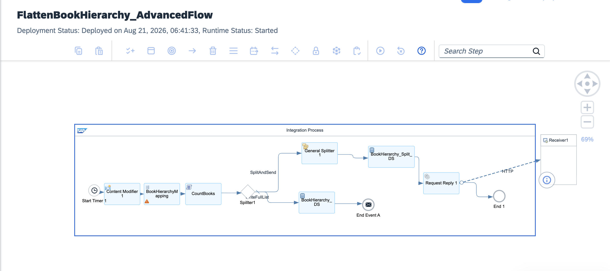

### 2. Timer Start — Scheduler
Simple Schedule, Repeat: None, Schedule: On Deployment.

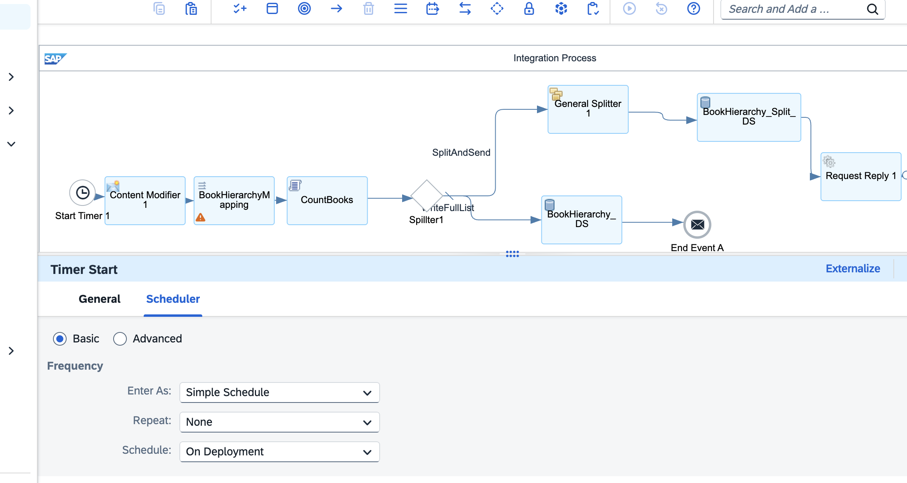

### 3. Message Mapping step — Processing tab
Static reference to the `BookMessageMapping` mapping resource.

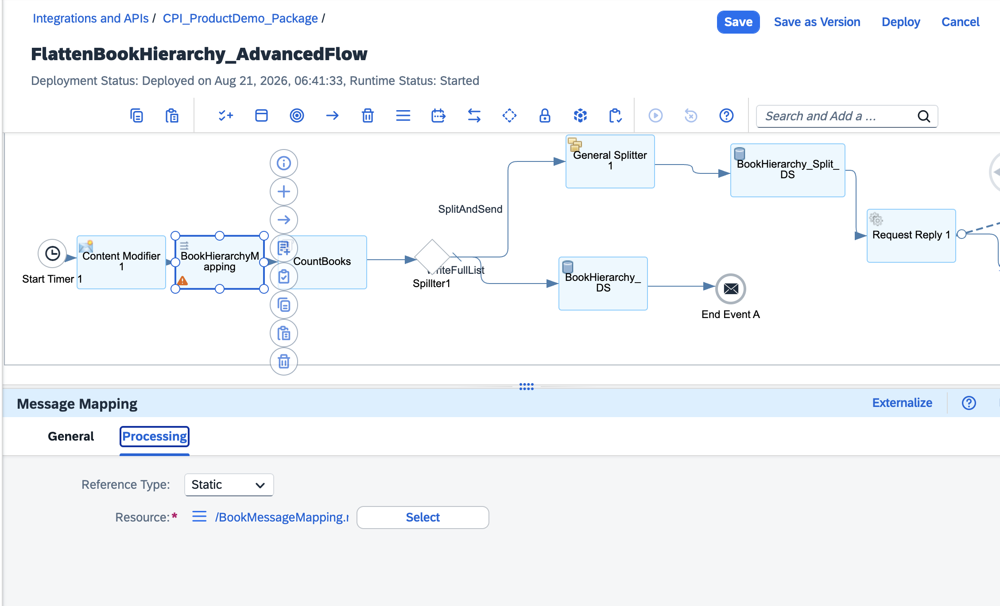

### 4. CountBooks — Groovy Script
Counts flattened `Book` elements and writes `BookCount` for the router to consume.

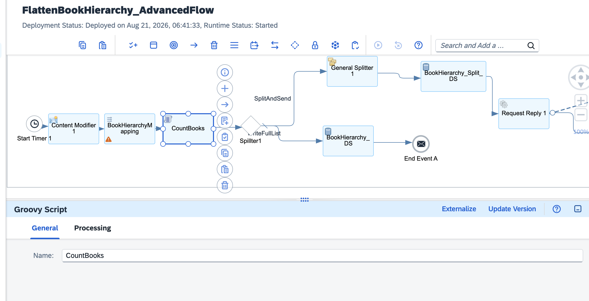

### 5. Router — Processing tab
Throw Exception unchecked; routing condition panel for the true/default branches.

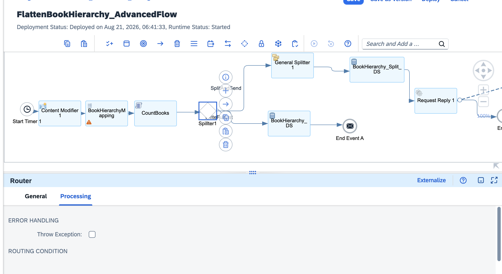

### 6. Router — condition detail
Non-XML expression: `${header.BookCount} > '0'`.

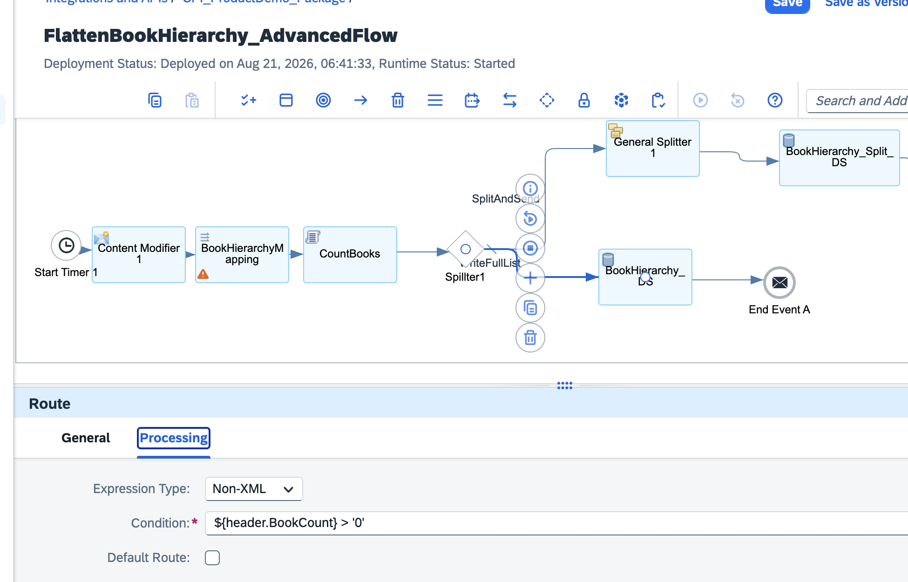

### 7. BookHierarchy_DS (fallback branch) — Processing tab
Visibility: **Integration Flow**, Retention Threshold 2d, Expiration 30d.

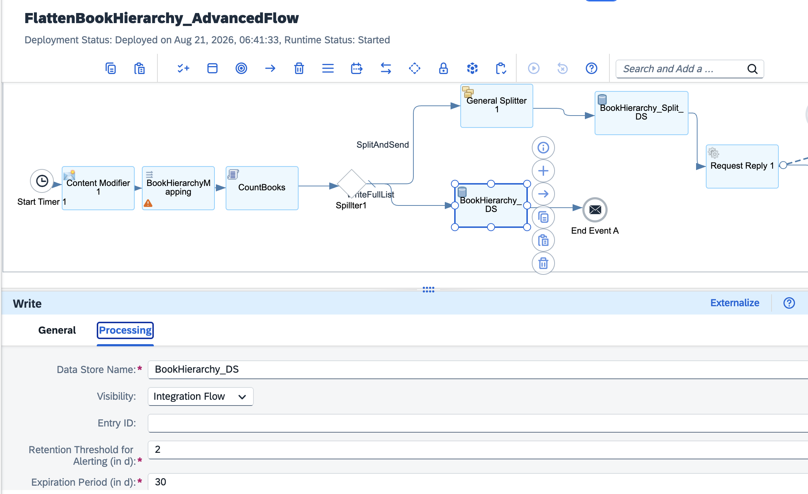

### 8. SplitAndSend route — General tab
Named branch carrying the true-condition path into the splitter.

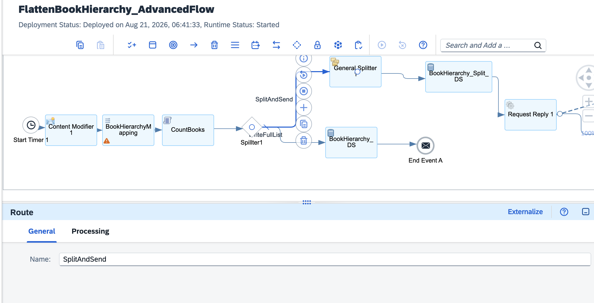

### 9. General Splitter — Processing tab
XPath `//Book`, Streaming ✓, Parallel Processing unchecked.

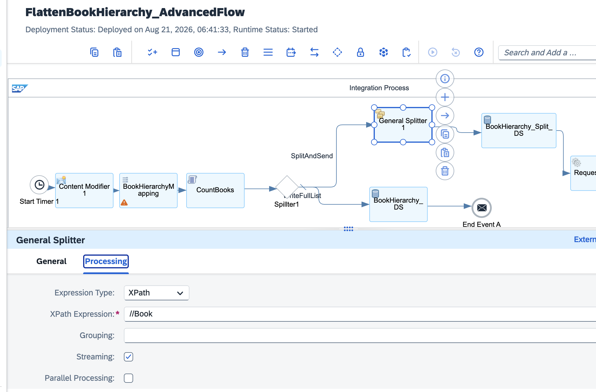

### 10. BookHierarchy_Split_DS — Processing tab
Visibility: **Global**, Entry ID: `${property.CamelSplitIndex}`.

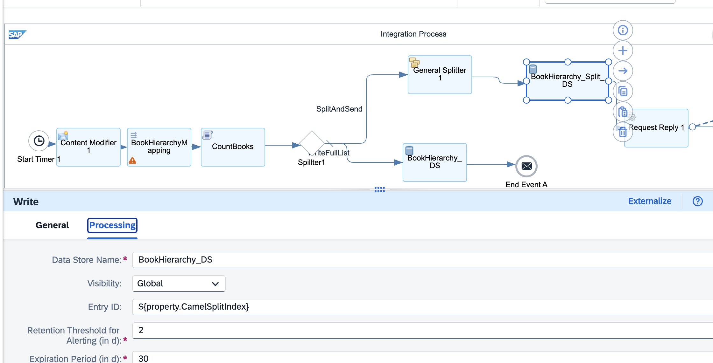

### 11. HTTP Adapter — Connection tab
`POST https://httpbin.org/post`, Proxy Type: Internet, Authentication: None.

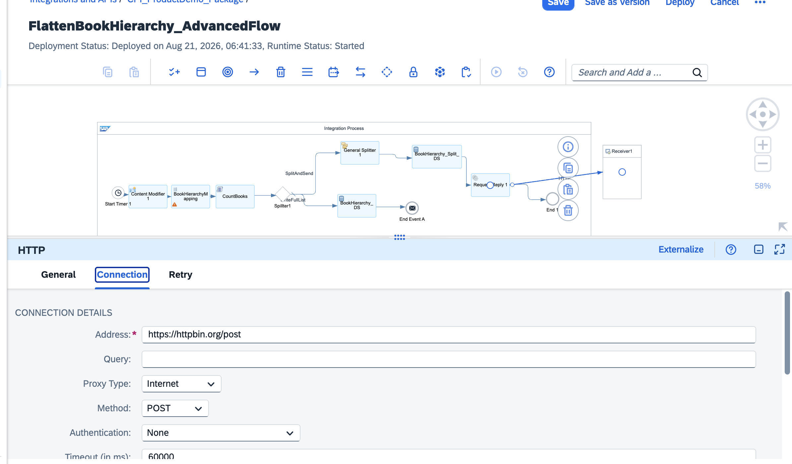

### 12. BookMessageMapping — removeContexts wired
Source `Book` → `removeContexts` → target `Book`, with `Author` mapped as an attribute.


*(Screenshots reference the trial tenant build deployed Aug 21, 2026.)*

## Environment

- SAP BTP Trial account, Integration Suite (Cloud Foundry)
- Package: `CPI_ProductDemo_Package`
- iFlow: `FlattenBookHierarchy_AdvancedFlow`
- No paid services

## Troubleshooting notes (for future reference)

| Symptom | Cause | Fix |
|---|---|---|
| Router always takes the default/fallback path | `BookCount` header not set before the router, or Groovy script ran before the mapping completed | Confirm step order: Mapping → CountBooks → Router, and that the Groovy script writes to `message.setHeader('BookCount', ...)` |
| Split Data Store entries overwrite each other | Entry ID left blank or hard-coded | Use `${property.CamelSplitIndex}` as the Entry ID so each split message gets a unique key |
| HTTP Adapter call fails from trial tenant | Outbound internet access needs Proxy Type = Internet, and destination must allow unauthenticated POST for a public test endpoint | Verify Connection tab: Proxy Type `Internet`, Authentication `None` for `httpbin.org` testing; switch to a real destination + auth for production |
| Splitter produces no messages | XPath doesn't match the *mapped* (flattened) structure, still pointed at the nested source structure | Point the Splitter's XPath at the post-mapping element (`//Book`), not the original `Bookstore/Genre/Author/Book` path |
